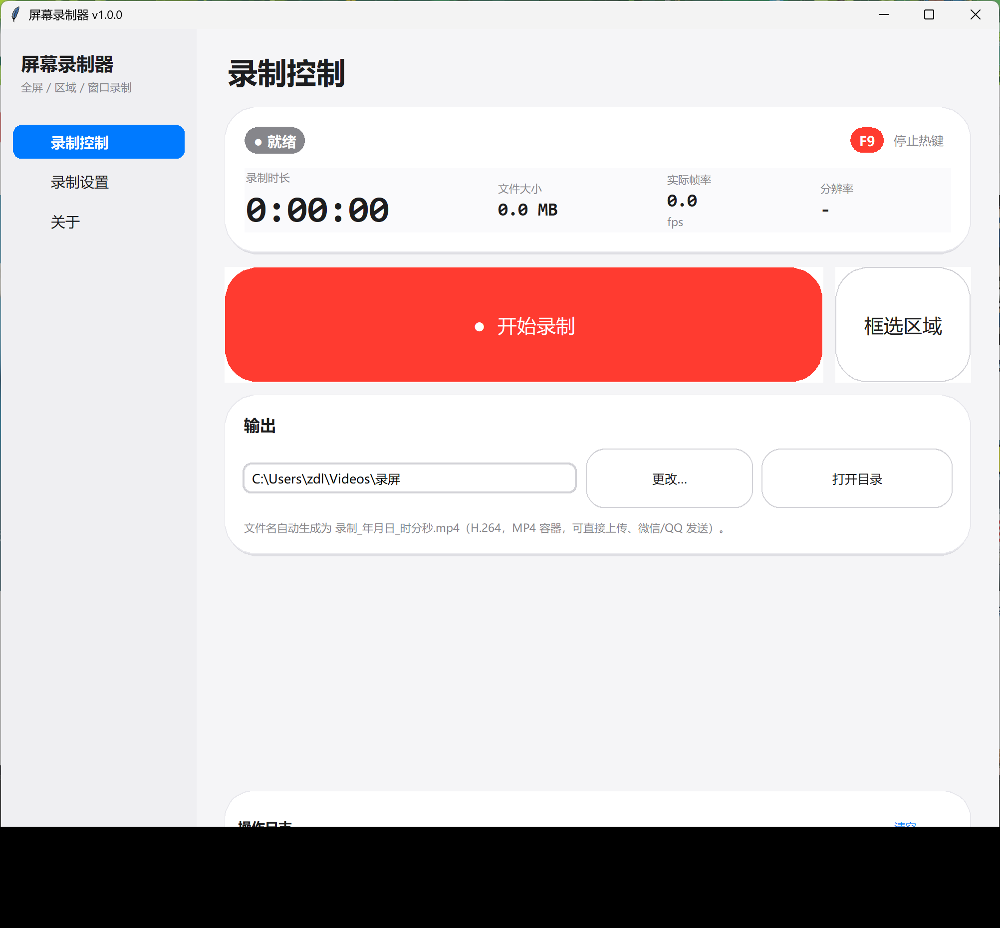
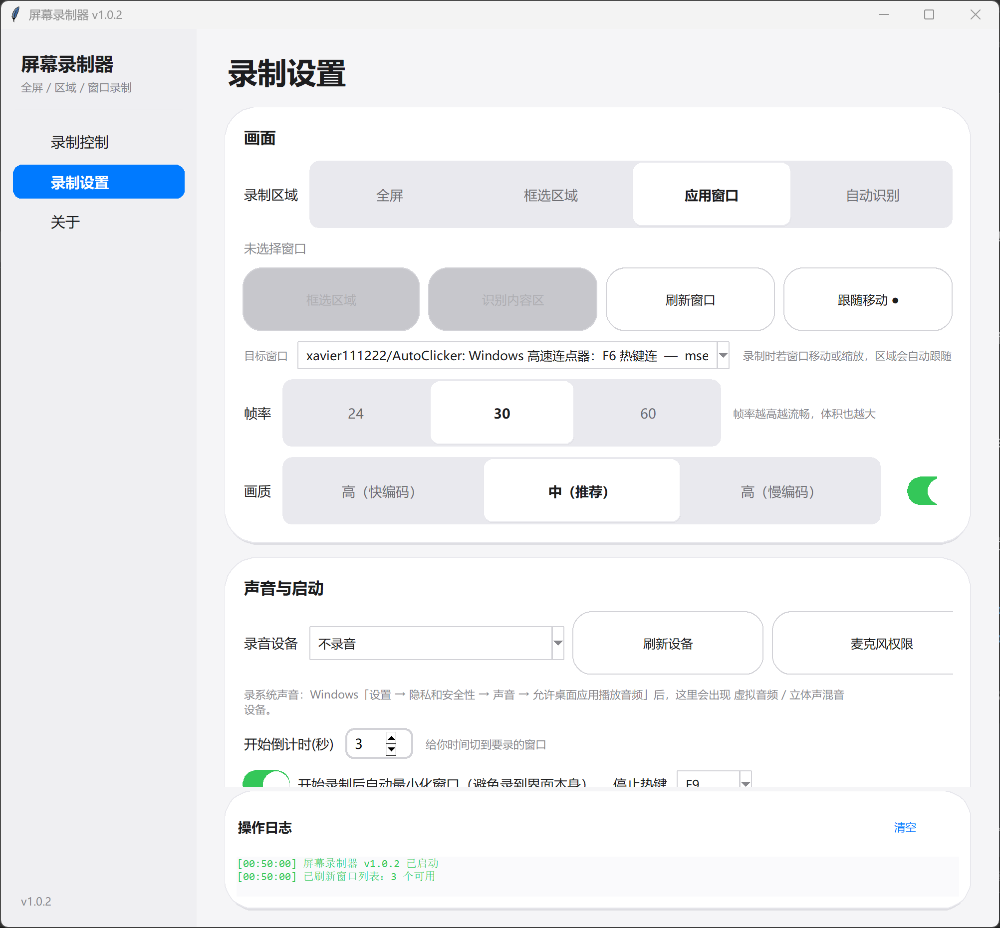

# Screen Recorder (ScreenRecorder)

[简体中文](README.md) | [English](README_EN.md)

A **single-file** Windows screen recorder: record the full screen or any region, output
standard **MP4 (H.264)** files you can send straight to WeChat, upload, or edit.

- Single-file exe, no installation (**ffmpeg bundled — nothing else to install**)
- License: **MIT**
- Records entirely locally; nothing is uploaded
- Fully supports high DPI (150% / 200% scaling)

| Recording control | Recording settings |
| --- | --- |
|  |  |

---

## Related tools

| Project | What it does |
| --- | --- |
| [GPU Switcher](https://github.com/xavier111222/GpuSwitcher) | One-click dGPU / integrated switching + per-app GPU assignment |
| [Auto Clicker](https://github.com/xavier111222/AutoClicker) | Clicking + macro scripting + background cross-app clicking |

All three share the same high-DPI UI skeleton (`ui_kit.py`), so they look and behave consistently.

---

## Quick start

1. Double-click **`屏幕录制器.exe`**
2. Pick "Full screen", or click **"Pick region"** and drag over what you want
3. Click **"● Start recording"** (or press **F9**) → recording begins after a countdown,
   and the window minimizes itself
4. To stop: press **F9** again or click "Stop recording"; the file is saved to the output folder

Download: <https://github.com/xavier111222/ScreenRecorder/releases/latest>

---

## Features

### Four capture-region modes

Not just "full screen" and "draw a box by hand" — you can record a specific app window, or
let the app work out the content area for you:

| Mode | Description |
| --- | --- |
| **Full screen** | The entire virtual desktop (across multiple monitors) |
| **Pick region** | Drag to select; the picker dims the background so you see exactly what you get |
| **App window** | Choose a program from the window list and record just that window, **optionally following it as it's moved or resized** |
| **Auto detect** | Analyzes the current frame and trims black bars / solid borders to frame the real content |

> **"Follow movement"** is the single most useful feature here: while recording, you can drag
> the target window with the mouse and the framing follows it automatically. Because ffmpeg's
> input size is fixed at startup, a size change triggers automatic segmented re-recording and
> the segments are then joined seamlessly into one file (`-c copy` lossless merge, audio kept
> in sync). If only the *position* changes and the size doesn't, recording isn't interrupted
> at all.

| Recording control | Recording settings |
| --- | --- |
|  |  |

### Everything else

| Feature | Description |
| --- | --- |
| Full-screen / region recording | The region picker dims the background — WYSIWYG |
| Frame rate | 24 / 30 / 60 fps |
| Quality | Three levels (x264 preset + CRF); medium is the best balance |
| Mouse cursor | Optionally draw the pointer into the frame (screen-capture APIs don't include it) |
| Record system audio | Lists dshow audio devices (microphone / stereo mix) automatically |
| Hotkey | Any F1–F12 to start/stop |
| Countdown | 0–10 seconds, giving you time to switch to the window you want |
| Auto-minimize | Minimizes itself when recording starts, so you don't capture the UI |
| Live info | Duration, file size, actual frame rate, resolution |
| Naming | `录制_YYYYMMDD_HHMMSS.mp4` |

### Recording recommendations

| Use case | Recommended settings |
| --- | --- |
| Demo / walkthrough | Picked region + 30fps + medium quality + cursor on |
| Game capture | Full screen + 60fps + high quality (much larger file) |
| Just explaining an idea | 24fps + high quality (fast encode) for the smallest file |
| Needs audio | First allow desktop apps to play audio in Windows sound settings, then refresh the device list |

---

## Command line

```bat
屏幕录制器.exe --version     :: show version
屏幕录制器.exe --selftest    :: self-test (ffmpeg / capture / DPI / audio devices)
屏幕录制器.exe --devices     :: list available audio input devices
```

---

## How does it work?

1. **Screen capture**: `mss` (GDI `BitBlt` + multithreading), about 8 ms per frame — easily
   enough for 1920×1080@30fps.
2. **Encoding**: raw BGRA frames are written straight to an `ffmpeg` subprocess's stdin:
   ```
   ffmpeg -f rawvideo -pix_fmt bgra -s WxH -framerate FPS -i -
          -c:v libx264 -preset veryfast -crf N -pix_fmt yuv420p out.mp4
   ```
   `yuv420p` guarantees playback on phones, WeChat, and Jianying.
3. **Timing**: the same `next += interval` scheduler as AutoClicker, so frame rate is stable
   and doesn't drift; it re-synchronizes automatically after falling more than 1 second behind.
4. **Mouse cursor**: capture APIs return frames without the pointer, so when needed it's drawn
   in memory before encoding.
5. **UI**: recording runs on a worker thread while the UI only displays state; thread
   messages go back through a queue (Tk isn't thread-safe; calling `root.after` directly
   crashes intermittently).

---

## ⚠ Notes

1. **Protected content can't be captured**: DRM/encrypted video (Netflix, iQIYI, etc.) plays
   back black or blank. This is a shared limitation of all screen recorders; this tool does
   not and should not attempt to bypass it.
2. Size estimate: 1080p 30fps at medium quality is about **6–10 MB/min**; 60fps is roughly
   1.5–2× that. Running out of disk space will interrupt recording.
3. Recording captures the whole display — mind your privacy and **don't record other people's
   screens when it isn't appropriate**.
4. If SmartScreen blocks the first run, click "More info → Run anyway" (common for unsigned
   open-source builds).
5. The bundled ffmpeg is a third-party static build (GPL/LGPL), invoked as a separate process
   with its code unmodified.

---

## Run from source and build

```bat
python -m venv .venv
.venv\Scripts\pip install -r requirements.txt

python screen_recorder.py            :: run from source
.venv\Scripts\python build.py        :: generate icon → PyInstaller (with ffmpeg) → copy to desktop
```

> The ffmpeg binary is packed into the exe (build output around 40–60 MB, which is expected).

### Project layout

```
ScreenRecorder/
├── screen_recorder.py   # main program: recording engine + region picker + segment joining + GUI + CLI
├── win_input.py         # Win32 window enumeration (app-window capture / content detection)
├── ui_kit.py            # Apple-style UI skeleton (high-DPI-safe component library)
├── make_icon.py         # generates assets/icon.ico
├── build.py             # one-click build and copy to desktop
├── assets/
│   ├── icon.ico
│   └── app.manifest     # Per-Monitor V2 DPI awareness declaration
├── docs/                # README screenshots
├── requirements.txt
├── LICENSE
└── README.md
```

---

## FAQ

**Q: Starting a recording says "ffmpeg not found"?**
A: Normally the exe already bundles it. If you changed the build, you can place `ffmpeg.exe`
next to the exe, or install ffmpeg and add it to PATH, then confirm with `--selftest`.

**Q: The file won't open / has audio but no video?**
A: Dimensions must be even numbers (the app already rounds down); if a busy GPU causes dropped
frames, try a lower frame rate or a smaller capture region.

**Q: No system audio recorded?**
A: Windows sound settings won't expose a device unless "allow desktop apps to play audio" is
enabled. Turn it on and click "Refresh devices".

**Q: Recording makes the system lag?**
A: Both capture and encoding are CPU-heavy. Drop to 24fps, pick the high quality (fast encode)
preset, or record just a window region instead of the full screen.

---

## License

MIT — see [LICENSE](LICENSE). Use at your own risk; the author is not responsible for any
consequences of using this tool.

The bundled ffmpeg is a third-party static build (GPL/LGPL), invoked as a separate process
with its code unmodified; its copyright and license terms ship with the binary.
